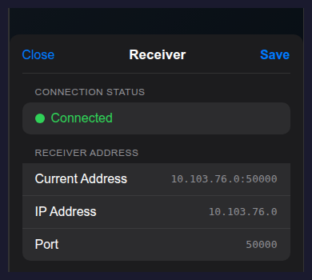

Calibration App Reference
=========================

This page covers the calibration app UI, capture settings, and uploaded files.

Core Functions
--------------

- Real-time AprilTag detection (Tag36h11) with 3D pose overlay
- Configurable capture settings for resolution, FPS, target detections, zoom,
  and camera selection
- Manual receiver connection via IP address and port
- One-tap upload of each recorded session to the receiver
- Video and metadata export for the downstream calibration pipeline

Capture Settings
----------------

.. list-table::
   :header-rows: 1
   :widths: 30 30 15

   * - Setting
     - Options
     - Default
   * - Resolution
     - 720p / 1080p
     - 720p
   * - FPS
     - 10 / 15 / 20 / 30
     - 30
   * - Target detections per tag
     - 50 / 100 / 200
     - 100
   * - Zoom
     - 1x-5x
     - 1x
   * - Camera
     - Front / Back
     - Back

UI Screens
----------

.. list-table::
   :class: app-ui-grid
   :widths: 1 1

   * - .. figure:: ../_static/app-ui-preview-clean.png
          :width: 250px
          :alt: RoSHI app preview screen

          Preview mode with capture settings, receiver status, target
          detections, and live tag feedback.

     - .. figure:: ../_static/app-ui-recording-clean.png
          :width: 250px
          :alt: RoSHI app recording screen

          Recording mode with the timer and live detection counts.

   Receiver settings. Tap the receiver status chip to open the sheet, confirm
   connection state, and edit the receiver IP address and port manually.

.. _app-reference-video:

During Capture
--------------

.. container:: behavior-video-grid

   .. container:: behavior-video-copy

      - The live AprilTag overlay shows a bounding box, local 3D axes, and a
        small readout with tag ID and camera-frame position.
      - The tag tracker stays gray in preview, turns red while recording below
        the target count, and turns green once the target is met.
      - The front camera starts with a short 3-second countdown before
        recording.
      - If recording stops before every tag reaches the target count, the
        session is still saved and uploaded, but the app warns that some tags
        are incomplete.
      - Exact tag placement and ID mapping are documented in
        :doc:`../hardware/components`.

   .. container:: behavior-video-media

      .. raw:: html

         <video class="app-ui-video" controls playsinline preload="metadata">
           <source src="../_static/roshi_app.mp4" type="video/mp4">
         </video>

Session Output
--------------

Each recording session uploads two files to the receiver:

- ``video_YYYYMMDD_HHMMSS.mp4``: H.264-encoded calibration video
- ``metadata_YYYYMMDD_HHMMSS.json``: per-frame metadata including timestamps,
  intrinsics, and AprilTag detections

Common Issues
-------------

- **Receiver not found**: confirm the phone and receiver machine are on the
  same Wi-Fi network and that the manually entered IP and port match the
  values shown in the receiver terminal.
- **Connection timeout**: check the receiver process, port, and any manual IP
  or port override inside the app.
- **Tags not detected**: keep the 42 mm tags flat, visible, and well lit, and
  avoid strong motion blur.
- **Low detection counts**: move more slowly and give the camera a little more
  time before stopping the recording.
